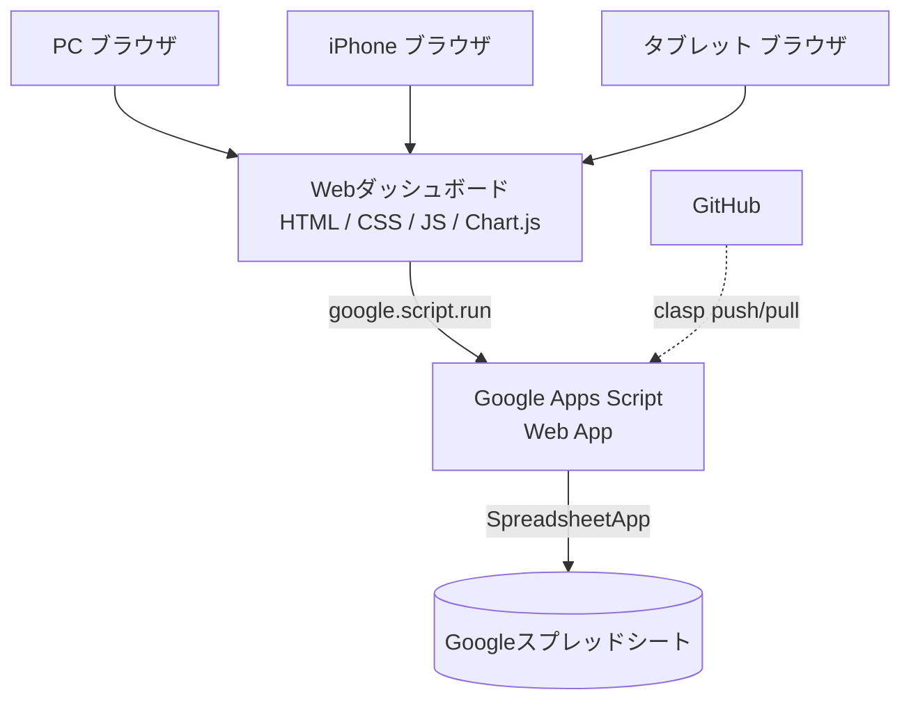

# システム構成

## 全体アーキテクチャ

## レイヤーの役割

| レイヤー | 役割 | 実装フェーズ |
|---|---|---|
| フロントエンド | 画面表示・ユーザー操作・グラフ描画 | Phase 1 |
| ダミーデータ層 | Phase1でのUI動作確認用データ | Phase 1 |
| GAS (Web App) | データ取得API・登録API・更新API・検証・ログ | Phase 3〜 |
| Googleスプレッドシート | データベース（10シート） | Phase 2〜 |
| GitHub + clasp | ソースコード管理・GASへのデプロイ | 継続 |

## Phase 1 時点の通信

Phase 1ではフロントエンドはGASにもスプレッドシートにも一切接続しません。
`frontend/js/data/dummyData.js` に定義したダミーデータのみを参照します。
Phase 2以降、同じ画面のデータ取得部分を `google.script.run.getXxxData()` に
差し替えていく設計にしています（画面のHTML/CSS構造は変更しません）。

## デプロイ構成（Phase3以降の想定）

GASのHTML Serviceでは複数ファイルを1つのHTMLとして結合して配信するため、
`frontend/` 配下のCSS/JSは最終的に `<style>` / `<script>` としてGAS用HTMLに
インライン化する変換ステップを追加します（Phase3で対応、既存のPhase1コードは
変更しません）。
